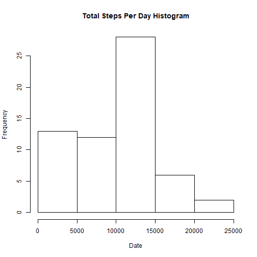
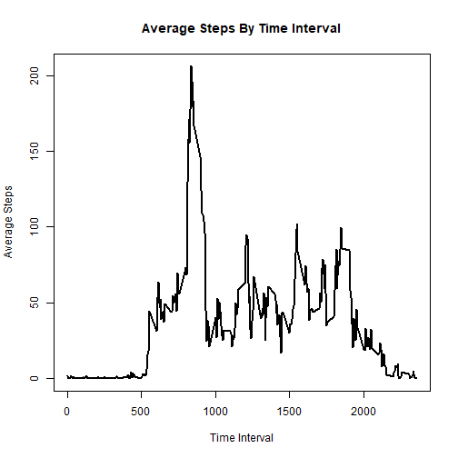
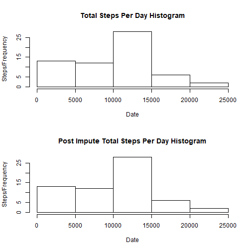
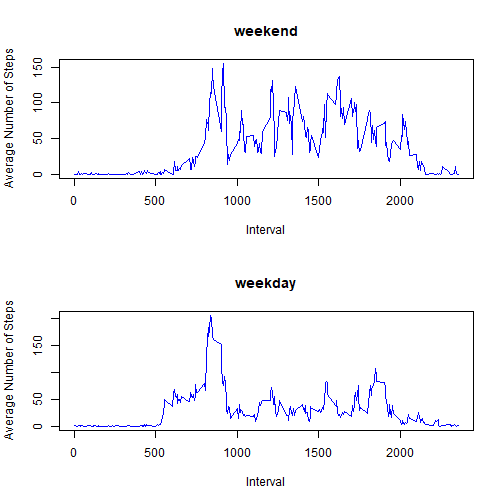

## Loading and preprocessing the data

```r
library(dplyr)

#Read CSV data file
dfDailySteps <- read.csv("activity.csv")

dfDailySteps <- mutate(dfDailySteps, date = as.Date(date, "%Y-%m-%d"))
```


## What is mean total number of steps taken per day?

```r
# Caclulate sum, mean and median steps per date
dailySummary <- dfDailySteps %>% group_by(date) %>% summarize(totalSteps = sum(steps, na.rm = TRUE), meanSteps = mean(steps, na.rm = TRUE), medianSteps = median(steps, na.rm = TRUE))

#Plot histogram of Total no. of steps per day
hist(dailySummary$totalSteps, xlab = "Date", ylab = "Frequency", main = "Total Steps Per Day Histogram")
```



```r
#Mean and Median steps per Day
dailySummary[,c("date","meanSteps")]
```

```
## # A tibble: 61 x 2
##          date meanSteps
##        <date>     <dbl>
##  1 2012-10-01       NaN
##  2 2012-10-02   0.43750
##  3 2012-10-03  39.41667
##  4 2012-10-04  42.06944
##  5 2012-10-05  46.15972
##  6 2012-10-06  53.54167
##  7 2012-10-07  38.24653
##  8 2012-10-08       NaN
##  9 2012-10-09  44.48264
## 10 2012-10-10  34.37500
## # ... with 51 more rows
```

```r
dailySummary[,c("date","medianSteps")]
```

```
## # A tibble: 61 x 2
##          date medianSteps
##        <date>       <dbl>
##  1 2012-10-01          NA
##  2 2012-10-02           0
##  3 2012-10-03           0
##  4 2012-10-04           0
##  5 2012-10-05           0
##  6 2012-10-06           0
##  7 2012-10-07           0
##  8 2012-10-08          NA
##  9 2012-10-09           0
## 10 2012-10-10           0
## # ... with 51 more rows
```

## What is the average daily activity pattern?

```r
meanStepsInterval <- dfDailySteps %>% group_by(interval) %>% summarize(avgSteps = mean(steps, na.rm = TRUE))

with(meanStepsInterval, plot(interval, avgSteps, xlab = "Time Interval", ylab = "Average Steps", main = "Average Steps By Time Interval", type = "l", lwd = 2))
```




## Imputing missing values

```r
naValueCount <- nrow(dfDailySteps[is.na(dfDailySteps[,1:3]) == TRUE,])
naValueCount
```

```
## [1] 2304
```

```r
# Calculate Median of Steps per Interval
medianStepsInterval <- dfDailySteps %>% group_by(interval) %>% summarize(medianSteps = median(steps, na.rm = TRUE))

# Merge original data frame with data frame having median steps by interval (medianStepsInterval)
mergedData <- merge(dfDailySteps, medianStepsInterval, by = "interval")

# Assign the median steps to only those that have NA values in the merged Data frame
mergedData <- mutate(mergedData, steps = ifelse(is.na(mergedData$steps), medianSteps, steps))

# Choose the original columns of the data frame by removing the medianSteps column and make it part of the new data set
newDataSet <- select(mergedData, c("steps", "date", "interval"))

# Caclulate sum, mean and median steps per date for new dataset
newdailySummary <- newDataSet %>% group_by(date) %>% summarize(totalSteps = sum(steps, na.rm = TRUE), meanSteps = mean(steps, na.rm = TRUE), medianSteps = median(steps, na.rm = TRUE))

# Histogram of total no. of steps taken each day befor and after imputing data
par(mfrow = c(2,1))

hist(dailySummary$totalSteps, xlab = "Date", ylab = "Steps/Frequency", main = "Total Steps Per Day Histogram")

hist(newdailySummary$totalSteps, xlab = "Date", ylab = "Steps/Frequency", main = "Post Impute Total Steps Per Day Histogram")
```



```r
#RESULT: Since median was considered to impute and most of those were 0s, there is not a significant difference between the original plot and the new plot

#Mean and Median steps per Day after imputing
newdailySummary[,c("date","meanSteps")]
```

```
## # A tibble: 61 x 2
##          date meanSteps
##        <date>     <dbl>
##  1 2012-10-01  3.961806
##  2 2012-10-02  0.437500
##  3 2012-10-03 39.416667
##  4 2012-10-04 42.069444
##  5 2012-10-05 46.159722
##  6 2012-10-06 53.541667
##  7 2012-10-07 38.246528
##  8 2012-10-08  3.961806
##  9 2012-10-09 44.482639
## 10 2012-10-10 34.375000
## # ... with 51 more rows
```

```r
newdailySummary[,c("date","medianSteps")]
```

```
## # A tibble: 61 x 2
##          date medianSteps
##        <date>       <dbl>
##  1 2012-10-01           0
##  2 2012-10-02           0
##  3 2012-10-03           0
##  4 2012-10-04           0
##  5 2012-10-05           0
##  6 2012-10-06           0
##  7 2012-10-07           0
##  8 2012-10-08           0
##  9 2012-10-09           0
## 10 2012-10-10           0
## # ... with 51 more rows
```

## Are there differences in activity patterns between weekdays and weekends?

```r
newDataSet <- mutate(newDataSet, weekdayIndicator = weekdays(newDataSet$date))

# Assign 0 to Weekdays
newDataSet[which(newDataSet$weekdayIndicator != "Saturday" & newDataSet$weekdayIndicator != "Sunday"), "weekdayIndicator"] <- 0

# Assign 1 to weekends
newDataSet[which(newDataSet$weekdayIndicator == "Saturday" | newDataSet$weekdayIndicator == "Sunday"), "weekdayIndicator"] <- 1

# Create factor variable
weekdayFactor <- factor(newDataSet$weekdayIndicator, levels = c(0,1), labels = c("Weekday","Weekend"))

# Assign factor to Weekday Indicator variable in the data set
newDataSet$weekdayIndicator <- weekdayFactor

# Split the data set into 2 different data frames
weekdayData <- newDataSet[which(newDataSet$weekdayIndicator == "Weekday"),]
weekendData <- newDataSet[which(newDataSet$weekdayIndicator == "Weekend"),]

# Aggregate based on interval for both Weekday and Weekend Data frames
weekdayAggInterval <- weekdayData %>% group_by(interval) %>% summarize(avgSteps = mean(steps))
weekendAggInterval <- weekendData %>% group_by(interval) %>% summarize(avgSteps = mean(steps))

# Plot the line graph for weekday and weekend
par(mfrow = c(2,1))

plot(weekendAggInterval$interval, weekendAggInterval$avgSteps, type = "l", xlab = "Interval", ylab = "Average Number of Steps", col = "blue", main = "weekend")

plot(weekdayAggInterval$interval, weekdayAggInterval$avgSteps, type = "l", xlab = "Interval", ylab = "Average Number of Steps", col = "blue", main = "weekday")
```


